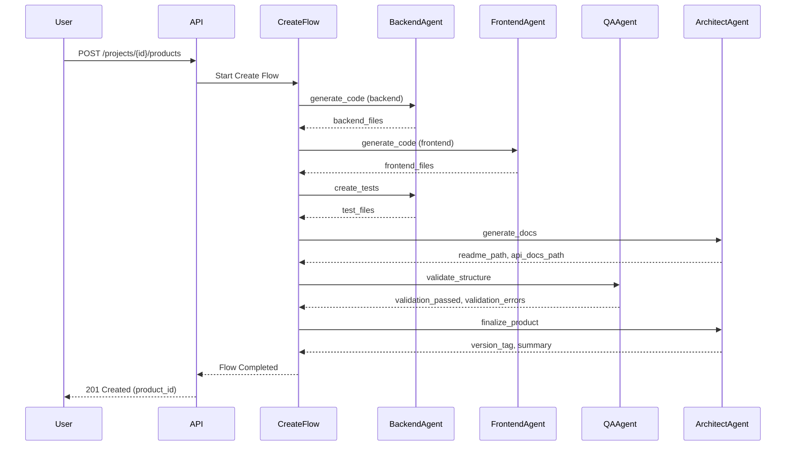

# Blugreen Create Flow: Technical Contract

**Version:** 1.0  
**Date:** 2026-01-03  
**Author:** Manus AI  
**Status:** Draft for Implementation

---

## Executive Summary

The Blugreen Create Flow is a step-based autonomous workflow for creating new software products from scratch. This document defines the technical contract for each step, including inputs, outputs, failure modes, and execution rules. The flow is designed to be executed by autonomous agents with full observability and resilience.

---

## 1. Flow Overview

The Create Flow consists of **five mandatory steps** executed in a fixed order. Each step is independent, idempotent (where applicable), and can be re-executed in isolation. The flow creates a complete product including code, tests, documentation, and validation.

### **1.1. Steps**

| Order | Step Name | Objective |
|---|---|---|
| 1 | `generate_code` | Generate backend and frontend code based on technical plan |
| 2 | `create_tests` | Create unit and integration tests for generated code |
| 3 | `generate_docs` | Generate technical documentation (API docs, README) |
| 4 | `validate_structure` | Validate project structure, dependencies, configuration |
| 5 | `finalize_product` | Create summary, version tag, prepare for deployment |

### **1.2. Flow Execution Rules**

The Create Flow follows strict execution rules to ensure consistency and reliability across autonomous agent executions. Steps must be executed sequentially in the order defined above, as each step may depend on the output of previous steps. However, each step is designed to be independent in terms of data access, meaning it reads its inputs from the database rather than relying on in-memory state from previous steps.

Failure in one step does not invalidate the output of previous steps. The flow can be paused at any point, the issue can be fixed, and the flow can be resumed from the failed step. This design allows for human intervention when necessary without requiring a complete restart of the workflow.

Idempotent steps (steps 1-4) can be re-executed safely without side effects. Non-idempotent steps (step 5) should not be re-executed automatically to avoid creating duplicate version tags or summaries. The state of each step is persisted to the database, allowing for full observability and the ability to resume from any point in the workflow.

---

## 2. API Contract

### **2.1. Entrypoint**

```
POST /projects/{project_id}/products
```

### **2.2. Request Body**

```json
{
  "product_name": "string",
  "stack": "string",
  "objective": "string"
}
```

| Field | Type | Description | Required | Example |
|---|---|---|---|---|
| `product_name` | string | Name of the product to be created | Yes | "Task Manager API" |
| `stack` | string | Desired technology stack | Yes | "React, FastAPI, PostgreSQL" |
| `objective` | string | High-level objective of the product | Yes | "Create a REST API for task management with user authentication" |

### **2.3. Response**

**Success (202 Accepted):**

```json
{
  "product_id": 123,
  "status": "running",
  "message": "Product creation started in background",
  "monitor_url": "/products/123/status"
}
```

**Error (400 Bad Request):**

```json
{
  "error": "InvalidInput",
  "message": "Missing required field: product_name"
}
```

### **2.4. Status Endpoint**

```
GET /products/{product_id}/status
```

**Response:**

```json
{
  "product_id": 123,
  "product_name": "Task Manager API",
  "status": "running",
  "steps": [
    {
      "step_name": "generate_code",
      "status": "done",
      "started_at": "2026-01-03T10:00:00Z",
      "completed_at": "2026-01-03T10:05:00Z",
      "error": null
    },
    {
      "step_name": "create_tests",
      "status": "running",
      "started_at": "2026-01-03T10:05:01Z",
      "completed_at": null,
      "error": null
    },
    {
      "step_name": "generate_docs",
      "status": "pending",
      "started_at": null,
      "completed_at": null,
      "error": null
    }
  ]
}
```

---

## 3. Step Definitions

### **3.1. Step 1: `generate_code`**

**Objective:**  
Generate backend and frontend code based on the technical plan. This step uses the Architect agent to interpret the product requirements and the Backend/Frontend agents to generate the actual code files.

**Input:**

| Field | Type | Description | Source |
|---|---|---|---|
| `project_id` | integer | ID of the project | API request |
| `technical_plan` | JSON | Architecture, database schema, API endpoints, UI components | Previous workflow step or generated from requirements |

**Output:**

| Field | Type | Description |
|---|---|---|
| `code_generated` | boolean | Indicates if code was successfully generated |
| `backend_files` | list[string] | Paths to backend files created (relative to project root) |
| `frontend_files` | list[string] | Paths to frontend files created (relative to project root) |

**Possible Failures:**

| Error Code | Description | Recovery Action |
|---|---|---|
| `InvalidTechnicalPlan` | The technical plan is missing required sections or is malformed | Regenerate technical plan with correct schema |
| `CodeGenerationError` | The agent failed to generate code for one or more components | Review agent logs, retry with clarified requirements |
| `FileSystemError` | Could not write generated files to disk | Check disk space and permissions, retry |

**State:** `pending` → `running` → `done` | `failed`

**Idempotent:** Yes (re-running will overwrite existing files with the same content)

**Re-executable:** Yes

---

### **3.2. Step 2: `create_tests`**

**Objective:**  
Create unit and integration tests for the generated code. This step uses the Backend agent to generate test files that cover the main functionality of the generated code.

**Input:**

| Field | Type | Description | Source |
|---|---|---|---|
| `project_id` | integer | ID of the project | API request |
| `backend_files` | list[string] | Paths to backend files | Output from `generate_code` |
| `frontend_files` | list[string] | Paths to frontend files | Output from `generate_code` |

**Output:**

| Field | Type | Description |
|---|---|---|
| `tests_created` | boolean | Indicates if tests were successfully created |
| `test_files` | list[string] | Paths to test files created (relative to project root) |

**Possible Failures:**

| Error Code | Description | Recovery Action |
|---|---|---|
| `MissingCodeError` | The code to be tested is not found | Ensure `generate_code` step completed successfully |
| `TestGenerationError` | The agent failed to generate tests for one or more components | Review agent logs, retry with clarified test requirements |
| `FileSystemError` | Could not write test files to disk | Check disk space and permissions, retry |

**State:** `pending` → `running` → `done` | `failed`

**Idempotent:** Yes

**Re-executable:** Yes

---

### **3.3. Step 3: `generate_docs`**

**Objective:**  
Generate technical documentation for the project, including API documentation (OpenAPI spec) and a README file. This step uses the Architect agent to create comprehensive documentation based on the generated code.

**Input:**

| Field | Type | Description | Source |
|---|---|---|---|
| `project_id` | integer | ID of the project | API request |
| `technical_plan` | JSON | Project architecture | Output from previous workflow |
| `backend_files` | list[string] | Paths to backend files | Output from `generate_code` |
| `frontend_files` | list[string] | Paths to frontend files | Output from `generate_code` |

**Output:**

| Field | Type | Description |
|---|---|---|
| `docs_generated` | boolean | Indicates if docs were successfully generated |
| `readme_path` | string | Path to the generated README.md |
| `api_docs_path` | string | Path to the generated API documentation (e.g., OpenAPI spec) |

**Possible Failures:**

| Error Code | Description | Recovery Action |
|---|---|---|
| `MissingCodeError` | The code to be documented is not found | Ensure `generate_code` step completed successfully |
| `DocGenerationError` | The agent failed to generate documentation | Review agent logs, retry with clarified documentation requirements |
| `FileSystemError` | Could not write documentation files to disk | Check disk space and permissions, retry |

**State:** `pending` → `running` → `done` | `failed`

**Idempotent:** Yes

**Re-executable:** Yes

---

### **3.4. Step 4: `validate_structure`**

**Objective:**  
Validate the project structure, dependencies, and configuration files. This step uses the QA agent to ensure the project follows best practices and has all necessary files in the correct locations.

**Input:**

| Field | Type | Description | Source |
|---|---|---|---|
| `project_id` | integer | ID of the project | API request |
| `project_path` | string | Path to the project root directory | Database (project record) |

**Output:**

| Field | Type | Description |
|---|---|---|
| `validation_passed` | boolean | Indicates if validation was successful |
| `validation_errors` | list[object] | List of errors found during validation (empty if passed) |

**Validation Checks:**

- Project directory structure follows conventions
- All required configuration files are present (e.g., `package.json`, `requirements.txt`, `docker-compose.yml`)
- Dependencies are correctly specified and have no version conflicts
- Environment variables are documented in `.env.example`
- No critical security issues (e.g., hardcoded secrets)

**Possible Failures:**

| Error Code | Description | Recovery Action |
|---|---|---|
| `InvalidProjectStructure` | The project directory structure is incorrect | Review and fix directory structure, retry |
| `DependencyError` | Dependencies are missing or have version conflicts | Update dependency files, retry |
| `ConfigurationError` | Configuration files are missing or contain errors | Add or fix configuration files, retry |

**State:** `pending` → `running` → `done` | `failed`

**Idempotent:** Yes

**Re-executable:** Yes

---

### **3.5. Step 5: `finalize_product`**

**Objective:**  
Finalize the product by creating a summary, version tag, and preparing for deployment. This step marks the product as ready for the build and deploy phases.

**Input:**

| Field | Type | Description | Source |
|---|---|---|---|
| `project_id` | integer | ID of the project | API request |
| `project_path` | string | Path to the project root directory | Database (project record) |
| `validation_passed` | boolean | Result from `validate_structure` | Output from `validate_structure` |

**Output:**

| Field | Type | Description |
|---|---|---|
| `product_finalized` | boolean | Indicates if the product was successfully finalized |
| `version_tag` | string | The version tag created for the product (e.g., "v1.0.0") |
| `summary` | string | A summary of the created product |

**Possible Failures:**

| Error Code | Description | Recovery Action |
|---|---|---|
| `ValidationFailedError` | The `validate_structure` step did not pass | Fix validation errors, re-run `validate_structure`, then retry |
| `VersionTagError` | Could not create a version tag | Check git repository status, retry |
| `SummaryGenerationError` | The agent failed to generate a summary | Review agent logs, retry |

**State:** `pending` → `running` → `done` | `failed`

**Idempotent:** No (version tag creation is not idempotent)

**Re-executable:** No (to avoid creating multiple version tags)

---

## 4. Data Models

### **4.1. `Product` Table**

```sql
CREATE TABLE product (
  id SERIAL PRIMARY KEY,
  project_id INTEGER REFERENCES project(id) NOT NULL,
  name VARCHAR(255) NOT NULL,
  stack VARCHAR(500),
  objective TEXT,
  status VARCHAR(50) NOT NULL DEFAULT 'pending',
  version_tag VARCHAR(50),
  summary TEXT,
  created_at TIMESTAMPTZ NOT NULL DEFAULT NOW(),
  updated_at TIMESTAMPTZ NOT NULL DEFAULT NOW()
);
```

### **4.2. `ProductStep` Table**

```sql
CREATE TABLE product_step (
  id SERIAL PRIMARY KEY,
  product_id INTEGER REFERENCES product(id) NOT NULL,
  step_name VARCHAR(100) NOT NULL,
  status VARCHAR(50) NOT NULL DEFAULT 'pending',
  started_at TIMESTAMPTZ,
  completed_at TIMESTAMPTZ,
  input_data JSONB,
  output_data JSONB,
  error_message TEXT,
  UNIQUE (product_id, step_name)
);
```

---

## 5. Implementation Notes

### **5.1. Agent Selection**

Each step uses one or more agents to perform its work. The mapping is as follows:

| Step | Primary Agent | Secondary Agent |
|---|---|---|
| `generate_code` | BackendAgent | FrontendAgent |
| `create_tests` | BackendAgent | - |
| `generate_docs` | ArchitectAgent | - |
| `validate_structure` | QAAgent | - |
| `finalize_product` | ArchitectAgent | - |

### **5.2. Observability**

All steps log their progress to the database via the `ProductStep` table. This allows for full observability of the workflow and the ability to resume from any point. Agents should log detailed information about their actions, including:

- Files created or modified
- External API calls made
- Errors encountered
- Decisions made (e.g., which template to use)

### **5.3. Resilience**

The Create Flow is designed to be resilient to failures. If a step fails, the workflow can be paused, the issue can be fixed (either automatically or manually), and the workflow can be resumed from the failed step. This is achieved by:

- Persisting step state to the database
- Making steps idempotent where possible
- Providing clear error messages and recovery actions

### **5.4. Future Enhancements**

- **Parallel Execution:** Steps that do not depend on each other (e.g., `create_tests` and `generate_docs`) could be executed in parallel to reduce total workflow time.
- **Conditional Steps:** Add support for conditional steps based on the product type (e.g., skip frontend generation for API-only products).
- **Step Rollback:** Implement a rollback mechanism for steps that have side effects (e.g., deleting generated files).

---

## 6. Sequence Diagram



---

## 7. Example Execution

### **7.1. Request**

```bash
curl -X POST https://api.blugreen.com.br/projects/1/products \
  -H "Content-Type: application/json" \
  -d '{
    "product_name": "Task Manager API",
    "stack": "FastAPI, PostgreSQL, React",
    "objective": "Create a REST API for task management with user authentication"
  }'
```

### **7.2. Response**

```json
{
  "product_id": 123,
  "status": "running",
  "message": "Product creation started in background",
  "monitor_url": "/products/123/status"
}
```

### **7.3. Monitoring**

```bash
curl https://api.blugreen.com.br/products/123/status
```

```json
{
  "product_id": 123,
  "product_name": "Task Manager API",
  "status": "running",
  "steps": [
    {
      "step_name": "generate_code",
      "status": "done",
      "started_at": "2026-01-03T10:00:00Z",
      "completed_at": "2026-01-03T10:05:00Z",
      "error": null
    },
    {
      "step_name": "create_tests",
      "status": "done",
      "started_at": "2026-01-03T10:05:01Z",
      "completed_at": "2026-01-03T10:08:00Z",
      "error": null
    },
    {
      "step_name": "generate_docs",
      "status": "running",
      "started_at": "2026-01-03T10:08:01Z",
      "completed_at": null,
      "error": null
    },
    {
      "step_name": "validate_structure",
      "status": "pending",
      "started_at": null,
      "completed_at": null,
      "error": null
    },
    {
      "step_name": "finalize_product",
      "status": "pending",
      "started_at": null,
      "completed_at": null,
      "error": null
    }
  ]
}
```

---

## 8. Conclusion

The Blugreen Create Flow provides a robust, observable, and resilient workflow for creating software products autonomously. By defining clear contracts for each step, including inputs, outputs, and failure modes, the flow enables autonomous agents to execute complex workflows with minimal human intervention. The step-based design allows for easy debugging, monitoring, and recovery from failures, making it suitable for production use.

---

**Document Version:** 1.0  
**Last Updated:** 2026-01-03  
**Status:** Ready for Implementation
